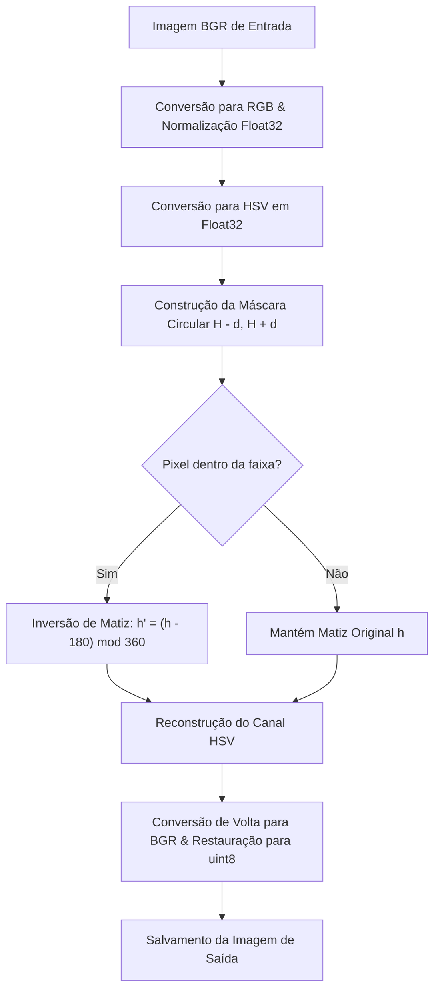

# PDI - Inversão de Matizes no Espaço HSV

Este repositório contém uma implementação para a Inversão Seletiva de Matizes utilizando o modelo de cores HSV (Hue, Saturation, Value). O programa foi desenvolvido para a disciplina de Processamento Digital de Imagens (PDI) do curso de Ciência da Computação da Universidade Estadual de Maringá (UEM)

---

## Como o Algoritmo Funciona

A inversão de matiz convencional de uma imagem inteira pode distorcer todo o contexto cromático. Este programa realiza uma inversão seletiva baseada em uma faixa angular informada pelo usuário.



### 1. Conversão em Ponto Flutuante de Alta Precisão
Para evitar erros de quantização comuns na representação inteira de 8 bits (onde a biblioteca OpenCV escala o matiz $H$ de $[0, 360)$ para $[0, 180)$ para caber em um único byte de 0 a 255), este programa:
1. Converte a imagem BGR (`uint8`) para RGB.
2. Normaliza os canais de cor para ponto flutuante de precisão simples (`float32` no intervalo $[0.0, 1.0]$).
3. Converte a imagem resultante para o espaço HSV.
4. Mantém o canal $H$ na faixa nativa $[0^\circ, 360^\circ)$ e os canais $S$ e $V$ na faixa $[0.0, 1.0]$.

### 2. Seleção de Faixa com Tratamento de *Wrap-Around*
O matiz é uma grandeza angular periódica de $360^\circ$. A faixa selecionada é dada pelo intervalo:
$$[H - d, H + d] \pmod{360}$$

O algoritmo trata o cruzamento de fronteiras em $0^\circ / 360^\circ$. Por exemplo, se $H = 10^\circ$ e $d = 30^\circ$, o limite inferior seria $-20^\circ \equiv 340^\circ$ e o superior seria $40^\circ$. O intervalo de seleção passa a ser a união de duas faixas circulares:
$$h \in [340^\circ, 360^\circ) \cup [0^\circ, 40^\circ]$$

### 3. Equação de Inversão
Para cada pixel cujas coordenadas de matiz $h$ estejam dentro da máscara selecionada, aplica-se a inversão diametral oposta no círculo de cores:
$$h' = (h - 180) \pmod{360}$$

Os canais de saturação ($S$) e brilho/valor ($V$) permanecem inalterados, garantindo que apenas a tonalidade da cor seja invertida, mantendo sua intensidade física e brilho originais.

---

## Saída do Programa

Ao finalizar a execução, o programa cria automaticamente o arquivo de saída contendo a imagem modificada salva no formato original com o sufixo indicando os parâmetros usados. Exemplo: `Paisagem_no_Inhotim_H0_d30.jpg`.

---

## Pré-requisitos e Como Executar

### 1. Criar e Ativar um Ambiente Virtual (Opcional, mas recomendado)
No diretório raiz do projeto, execute:
```bash
# Criar o ambiente virtual chamado 'venv'
python3 -m venv venv

# Ativar o ambiente virtual (Linux/macOS)
source venv/bin/activate

# Ou ativar no Windows
# .\venv\Scripts\activate
```

### 2. Instalar as Dependências
Com o ambiente virtual ativo, instale as bibliotecas necessárias:
```bash
pip install -r requirements.txt
```

### 3. Executar o Script
O programa aceita três argumentos obrigatórios via linha de comando:
```bash
python programa.py <caminho_da_imagem> <H> <d>
```
* **`<caminho_da_imagem>`**: Caminho para o arquivo de imagem de entrada (formatos suportados: `.jpg`, `.png`, `.bmp`, `.webp`, `.tiff`).
* **`<H>`**: Matiz central da faixa que deseja inverter (valor de `0` a `360` graus).
* **`<d>`**: Raio da faixa de matiz ao redor de `H` (valor de `0` a `180` graus).


#### Exemplo Prático:
Para inverter os tons vermelhos da imagem `Paisagem_no_Inhotim.jpg` (onde o vermelho está próximo de `0°`), usando um raio de `30°`:
```bash
python programa.py Paisagem_no_Inhotim.jpg 0 30
```
