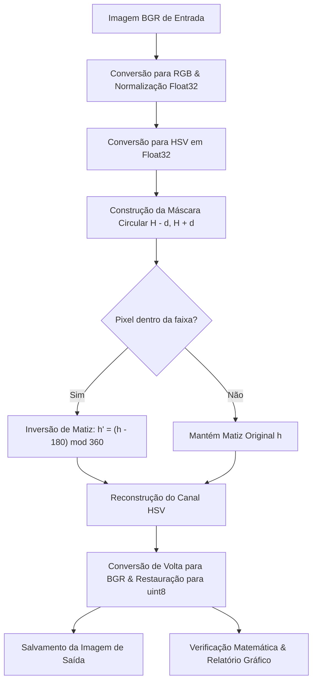
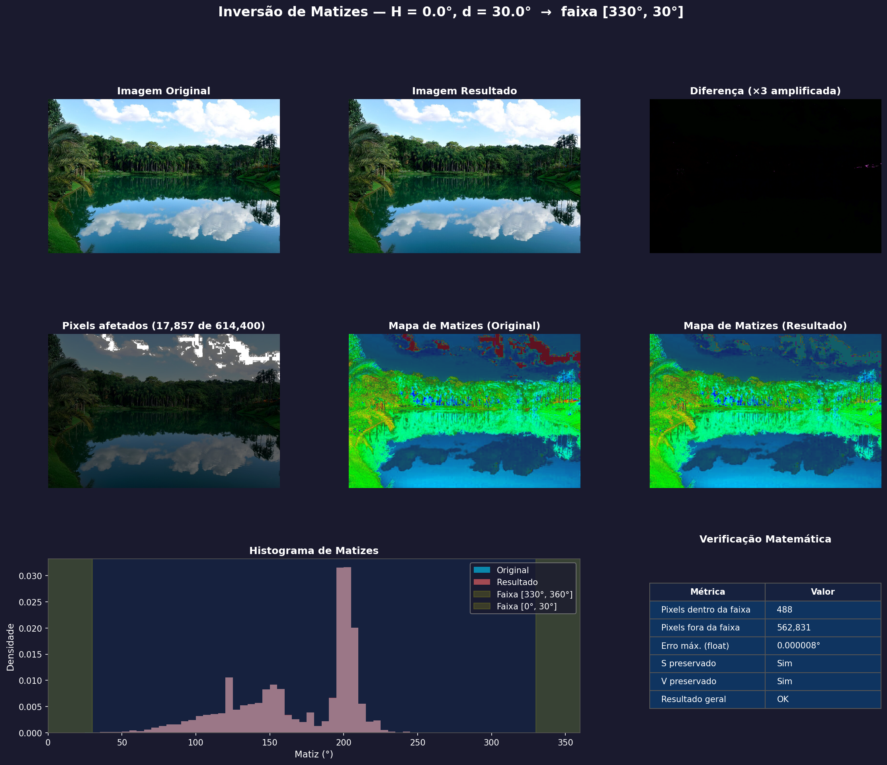

# PDI - Inversão de Matizes no Espaço HSV

Este repositório contém uma implementação para a **Inversão Seletiva de Matizes** utilizando o modelo de cores **HSV (Hue, Saturation, Value)**. O programa foi desenvolvido para a disciplina de **Processamento Digital de Imagens (PDI)** e implementa manipulações matemáticas rigorosas sobre canais de cor em ponto flutuante.

---

## Como o Algoritmo Funciona

A inversão de matiz convencional de uma imagem inteira pode distorcer todo o contexto cromático. Este programa realiza uma **inversão seletiva** baseada em uma faixa angular informada pelo usuário.



### 1. Conversão em Ponto Flutuante de Alta Precisão
Para evitar erros de quantização comuns na representação inteira de 8 bits (onde a biblioteca OpenCV escala o matiz $H$ de $[0, 360)$ para $[0, 180)$ para caber em um único byte de 0 a 255), este programa:
1. Converte a imagem BGR (`uint8`) para RGB.
2. Normaliza os canais de cor para ponto flutuante de precisão simples (`float32` no intervalo $[0.0, 1.0]$).
3. Converte a imagem resultante para o espaço HSV.
4. Mantém o canal $H$ na faixa nativa $[0^\circ, 360^\circ)$ e os canais $S$ e $V$ na faixa $[0.0, 1.0]$.

### 2. Seleção de Faixa com Tratamento de *Wrap-Around*
O matiz é uma grandeza angular periódica de $360^\circ$. A faixa selecionada é dada pelo intervalo:
$$[H - d, H + d] \pmod{360}$$

O algoritmo trata de forma inteligente o cruzamento de fronteiras em $0^\circ / 360^\circ$. Por exemplo, se $H = 10^\circ$ e $d = 30^\circ$, o limite inferior seria $-20^\circ \equiv 340^\circ$ e o superior seria $40^\circ$. O intervalo de seleção passa a ser a união de duas faixas circulares:
$$h \in [340^\circ, 360^\circ) \cup [0^\circ, 40^\circ]$$

### 3. Equação de Inversão
Para cada pixel cujas coordenadas de matiz $h$ estejam dentro da máscara selecionada, aplica-se a inversão diametral oposta no círculo trigonométrico de cores:
$$h' = (h - 180) \pmod{360}$$

Os canais de saturação ($S$) e brilho/valor ($V$) permanecem **rigorosamente inalterados**, garantindo que apenas a tonalidade da cor seja invertida, mantendo sua intensidade física e brilho originais.

---

## Verificação Matemática Rigorosa

O script realiza testes estritos pós-processamento para garantir a integridade matemática e a correção científica do algoritmo:

1. **Validação Interna da Faixa**: Garante que todos os pixels afetados sofreram um deslocamento circular exato de $180^\circ$ ($\pm 0.01^\circ$ de tolerância em float).
2. **Validação Externa da Faixa**: Garante que nenhum pixel fora da faixa delimitada teve seu matiz alterado (tolerância de $0.00^\circ$).
3. **Preservação de $S$ e $V$**: Valida que a diferença máxima absoluta entre os canais de Saturação e Valor da imagem original e da modificada seja exatamente de $0.0000000000$.
4. **Prova de Involução**: Demonstra numericamente a propriedade autoinversa da operação:
   $$f(f(x)) = x$$
   Aplicar o mesmo algoritmo de inversão com os mesmos parâmetros na imagem modificada retorna exatamente a imagem original (erro máximo em float inferior a $0.01^\circ$).
5. **Análise de Quantização**: Apresenta uma análise de como a conversão final para 8 bits (`uint8` para salvar no disco) introduz pequenas perdas de precisão cromática (quantização), ajudando a separar o comportamento teórico ideal das limitações inerentes de formatos de imagem discretos.

---

## Relatório Visual Gerado

Ao finalizar a execução, o programa cria automaticamente dois arquivos de saída:
1. **Imagem Modificada**: Salva no formato original com o sufixo indicando os parâmetros usados. Exemplo: `Paisagem_no_Inhotim_H0_d30.jpg`.
2. **Relatório Gráfico Completo**: Um painel estatístico em alta definição salvo como `comparacao_{nome_imagem}_H{H}_d{d}.png`.

O painel de comparação exibe:
* **Imagem Original vs. Resultado**: Comparação visual direta.
* **Diferença Absoluta Amplificada (3x)**: Destaca quais pixels sofreram alteração e a magnitude da mudança cromática.
* **Overlay da Máscara de Transição**: Destaca visualmente na imagem os pixels que estavam dentro do escopo $[H-d, H+d]$.
* **Mapas de Matizes (Original e Resultado)**: Renderização exclusiva do canal de Matiz de cada imagem utilizando o mapa de cores cíclico `hsv`, aplicando a Saturação real da imagem como transparência para facilitar a identificação das cores puras.
* **Histograma de Densidade de Matizes**: Mostra as distribuições angulares de cor antes e depois do processo, destacando com uma faixa amarela os limites $[H-d, H+d]$.
* **Tabela de Validação Matemática**: Resumo das métricas calculadas pelo sistema de verificação.

> Exemplo de relatório gráfico gerado para `Paisagem_no_Inhotim.jpg` com `H = 0` e `d = 30`:
> 

---

## Pré-requisitos e Como Executar

### 1. Criar e Ativar um Ambiente Virtual (Opcional, mas recomendado)
No diretório raiz do projeto, execute:
```bash
# Criar o ambiente virtual chamado 'venv'
python3 -m venv venv

# Ativar o ambiente virtual (Linux/macOS)
source venv/bin/activate

# Ou ativar no Windows
# .\venv\Scripts\activate
```

### 2. Instalar as Dependências
Com o ambiente virtual ativo, instale as bibliotecas necessárias:
```bash
pip install -r requirements.txt
```

### 3. Executar o Script
O programa aceita três argumentos obrigatórios via linha de comando:
```bash
python programa.py <caminho_da_imagem> <H> <d> [flag]
```
* **`<caminho_da_imagem>`**: Caminho para o arquivo de imagem de entrada (formatos suportados: `.jpg`, `.png`, `.bmp`, `.webp`, `.tiff`).
* **`<H>`**: Matiz central da faixa que deseja inverter (valor de `0` a `360` graus).
* **`<d>`**: Raio da faixa de matiz ao redor de `H` (valor de `0` a `180` graus).
* **`[flag]`**: 
  `-c` para verificação completa dos resultados
  `-n` para somente salvar o resultado após execução


#### Exemplo Prático:
Para inverter os tons vermelhos da imagem `Paisagem_no_Inhotim.jpg` (onde o vermelho está próximo de `0°`), usando um raio de `30°`:
```bash
python programa.py Paisagem_no_Inhotim.jpg 0 30
```

Seu console imprimirá o detalhamento completo das verificações matemáticas da seguinte forma:

```text
====================================================
  INVERSÃO DE VALORES DE MATIZES (HSV)
====================================================
  Imagem:  Paisagem_no_Inhotim.jpg
  H = 0.0°, d = 30.0°
  Faixa:   [330.0°, 30.0°]
  Inversão: h' = (h - 180) mod 360
====================================================

  Imagem carregada: 960×640 pixels
  Pixels afetados: 17,857 de 614,400 (2.9%)
  Imagem salva em: Paisagem_no_Inhotim_H0_d30.jpg

  ...
  >>> TODAS AS VERIFICAÇÕES PASSARAM! <<<
```
